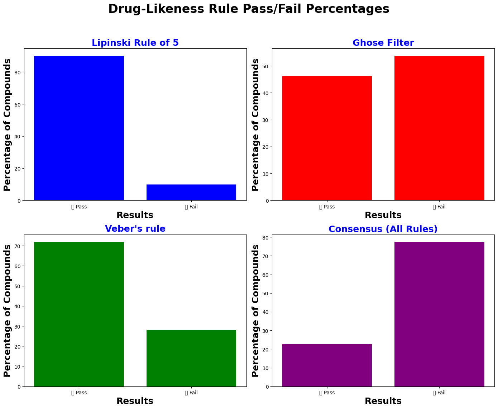

# Advanced Oral Bioavailability Screening and Visual Analysis of Molecular Filters Using Pandas and Matplotlib

A high-performance cheminformatics tool designed to automate oral bioavailability filtering. This pipeline translates medicinal chemistry rules into highly optimized Python logic, screening and visualizing a dataset of **15,166 compounds** across 9 molecular descriptors in seconds.

## 🧪 Integrated Filters
* **Lipinski's Rule of 5:** Benchmarking fundamental membrane permeability.
* **Ghose Filter:** Enforcing rigid boundaries for functional drug-like properties.
* **Veber's Rules:** Assessing molecular flexibility and Polar Surface Area (TPSA).
* **LogP Sweet Spot:** Targeting the ideal hydrophilic-lipophilic balance (0.5–3.5).

## 📊 Pipeline Architecture & Logic Steps

### 1️⃣ Data Hygiene & Subsetting
* **Auditing:** Inspected data using `df.shape` (15,166 rows, 34 columns) and `df.columns.tolist()`.
* **Feature Selection:** Isolated 9 relevant molecular descriptors using `.copy()` to avoid `SettingWithCopyWarning`.
* **Standardization:** Renamed "Molecule" column to "SMILES" for structural clarity.

### 2️⃣ Type Hardening (Bug Fixing)
* **The Fix:** Resolved string-to-numeric type mismatches (e.g., text-formatted Molecular Weights causing comparison errors) using `pd.to_numeric(errors='coerce')` to guarantee pipeline resilience.

### 3️⃣ Vectorized Rules Mapping
* **Chemistry to Math:** Replaced slow loops with fast Pandas vectorization. Translated chemical filters into Boolean maps, converting them via `.astype(int)` to instantly sum up molecular violations.
* **Labeling:** Applied `.apply(lambda)` to flag compounds as `✅ Pass` or `❌ Fail` based on each rule's specific violation tolerance.

### 4️⃣ Consensus Execution
* **Multi-Parametric Filter:** Used `.apply(axis=1)` to evaluate all 4 columns concurrently. A compound receives a final `✅ Pass` only if it simultaneously satisfies Lipinski, Ghose, Veber, and the LogP sweet spot.

### 5️⃣ Data Visualization
* **Visualizing the Drop-off:** Leveraged `matplotlib.pyplot` to generate a 2x2 grid of bar charts, dynamically comparing the pass/fail distribution across all individual rules and the final strict consensus.

## 📈 Screening Results & Insights

* **Lipinski Pass Rate:** 90.21%
* **Veber Pass Rate:** 71.97%
* **Ghose Pass Rate:** 46.20%
* **LogP Sweet Spot:** 44.13%
* **Consensus (Passed All Filters):** **22.48%**

*Takeaway: The steep drop to a 22.48% consensus rate highlights the computational bottleneck in early-stage R&D drug discovery—the molecular "sweet spot" is exceptionally narrow.*

## 🚀 Repository Contents
* `compounds_descriptors.csv`: The raw input dataset containing the original 15,166 compounds and their features.
* `bioavailability_screening_results.csv`: The final processed output featuring violation counts, pass/fail labels, and the ultimate consensus judgment.
* `Bioavailability_Screening_Charts.png`: The exported Matplotlib visualization showing the drug-likeness pass/fail distributions.
* `*.ipynb`: Interactive Google Colab notebook featuring data exploration, debugging logs, Matplotlib visualization, and live outputs.
* `*.py`: Production-ready, clean Python script version of the automation logic.
